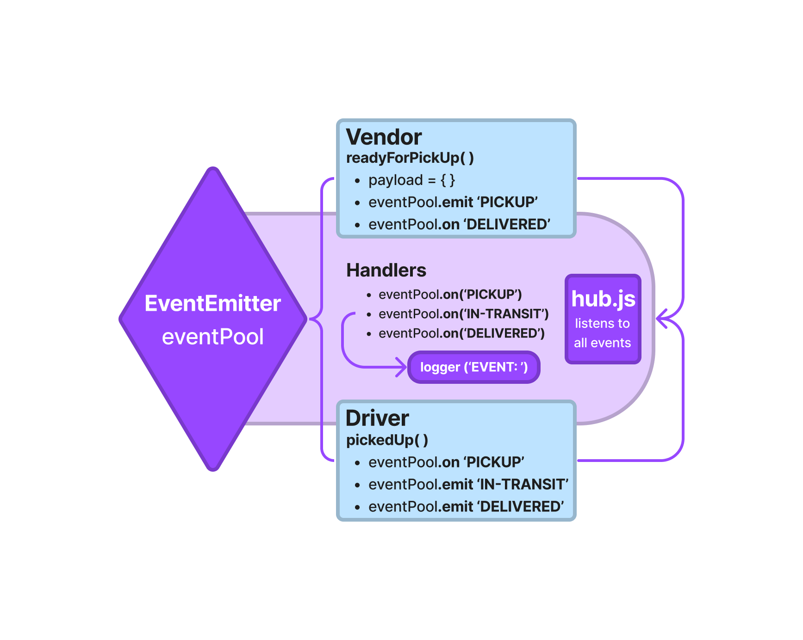

# Project: Event Driven Applications

### Author: Dustin Apodaca

### Problem Domain

- Build an application for a product called CAPS - The Code Academy Parcel Service. The purpose is to build out a system that emulates a real world supply chain. CAPS will simulate a delivery service where vendors (such a flower shops) will ship products using our delivery service and when our drivers deliver them, each vendor will be notified that their customers received what they purchased.

- An event driven application that “distributes” the responsibility for logging to separate modules, using only events to trigger logging based on activity.

### Links and Resources

- [CI/CD](https://github.com/dustinapodaca/caps/actions) (GitHub Actions)
<!-- - [Prod Deployment]()
- [Dev Deployment]() -->

#### How to initialize/run your application (where applicable)

- `npm start`
- `node hub.js`

#### Features / Routes

- Hub:
  - `logger` - to log all events
  - `eventPool.on('event', payload)` - to listen for all events

- Vendor:
  - `pickup` - emits to simulate a new order being placed and ready for pickup
  - `delivered` - listens to simulate a package being delivered

- Driver:
  - `pickedUp` - listens to simulate a package being picked up
  - `in-transit` - emits to simulate a package in transit
  - `delivered` - emits to simulate a package being delivered

#### Tests

- How do you run tests?
  - `npm test`

#### UML

Link to an image of the UML for your application and response to events:

