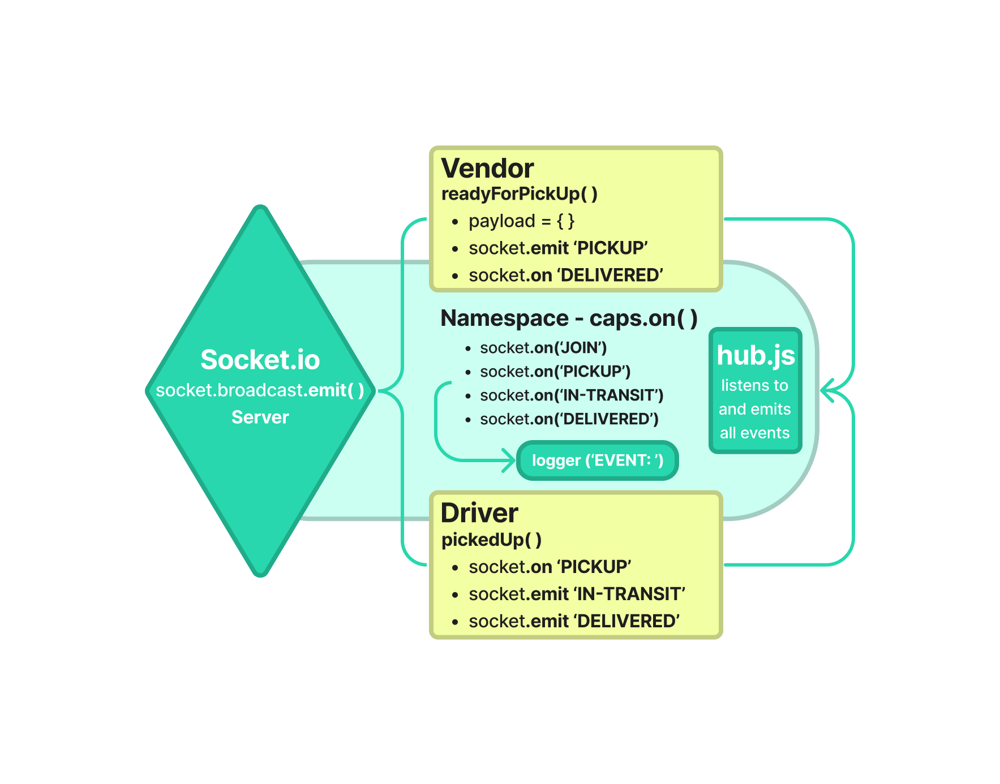

# Project: CAPS
### Author: Dustin Apodaca
---

### Phase 1: Event Driven Applications
### Phase 2: Socket.io
### Phase 3: Message Queues
---

##  Problem Domain
### Phase 1: Event Driven Applications

- Build an application for a product called CAPS - The Code Academy Parcel Service. The purpose is to build out a system that emulates a real world supply chain. CAPS will simulate a delivery service where vendors (such a flower shops) will ship products using our delivery service and when our drivers deliver them, each vendor will be notified that their customers received what they purchased.

- An event driven application that “distributes” the responsibility for logging to separate modules, using only events to trigger logging based on activity.

### Phase 2: Socket.io

- Refactor build of our delivery tracking system, creating an event observable over a network with Socket.io.

- The intent is to build the data services that would drive a suite of applications where one can see pickups and deliveries in real-time.

### Phase 3: Message Queues

- Implement a system to guarantee that notification payloads are read by their intended subscriber. Rather than just triggering an event notification and hope that client applications respond, implement a “Queue” system so that nothing gets lost.

- Every event sent will be logged and held onto by the server until the intended recipient acknowledges that they received the message. At any time, a subscriber can get all of the messages they might have missed.

### Links and Resources

- [CI/CD](https://github.com/dustinapodaca/caps/actions) (GitHub Actions)
<!-- - [Prod Deployment]()
- [Dev Deployment]() -->

#### How to initialize/run your application (where applicable)

- `npm start`
- `nodemon`
- `node hub.js`
- `node index.js`

##  Features / Routes
### Phase 1: Event Driven Applications

- Hub:
  - `logger` - to log all events
  - `eventPool.on('event', payload)` - to listen for all events

- Vendor:
  - `pickup` - emits to simulate a new order being placed and ready for pickup
  - `delivered` - listens to simulate a package being delivered

- Driver:
  - `pickedUp` - listens to simulate a package being picked up
  - `in-transit` - emits to simulate a package in transit
  - `delivered` - emits to simulate a package being delivered

### Phase 2: Socket.io

- Socket.io Hub:
  - `logger` - to log all events
  - `io` - Socket.io server instance
  - `caps` - Socket.io namespace
  - `caps.on('connection', socket)` - to listen for new connections
  - `socket.on('event', payload)` - to listen for all events.

- Vendor:
  - `pickup` - emits to simulate a new order being placed and ready for pickup
  - `delivered` - listens to simulate a package being delivered

- Driver:
  - `pickedUp` - listens to simulate a package being picked up
  - `in-transit` - emits to simulate a package in transit
  - `delivered` - emits to simulate a package being delivered

### Phase 3: Message Queues

- Socket.io Hub:
  - `logger` - to log all events
  - `io` - Socket.io server instance
  - `caps` - Socket.io namespace
  - `caps.on('connection', socket)` - to listen for new connections
  - `socket.join` - room implementation for each vendor
  - `socket.on('event', payload)` - to listen for all events in each room and add the appropriate payloads to the created Queues.
  - `socket.on('getAll', payload)` - to listen for and get all messages for all events in each room.
  - `socket.on('received', payload)` - to listen for and remove an instance off the queue for a specific event in each room.

- Queue Data Structure:
  - `new Queue()` - create new Queue to store all stores, events, and payloads for drivers and vendors.
  - `queue.enqueue` - to add a payload to the queue.
  - `queue.delete` - to remove a payload from the queue.
  - `queue.read` - to read a specific payload in the queue.
  - `queue.readAll` - to read all payloads in the queue.

- Vendor:
  - `pickup` - emits to simulate a new order being placed and ready for pickup
  - `delivered` - listens to simulate a package being delivered
  - `getAll` - emits to get all messages for all events in Vendor Queue.
  - `received` - emits to remove an instance off the queue for a specific event received in Vendor Queue.

- Driver:
  - `pickedUp` - listens to simulate a package being picked up
  - `in-transit` - emits to simulate a package in transit
  - `delivered` - emits to simulate a package being delivered
  - `getAll` - emits to get all messages for all events in Driver Queue.
  - `received` - emits to remove an instance off the queue for a specific event received in Driver Queue.

### Tests

- How do you run tests?
  - `npm test`

##  UML
Link to an image of the UML for your application and response to events:
### Phase 1: Event Driven Applications

### Phase 2: Socket.io

### Phase 3: Message Queues

